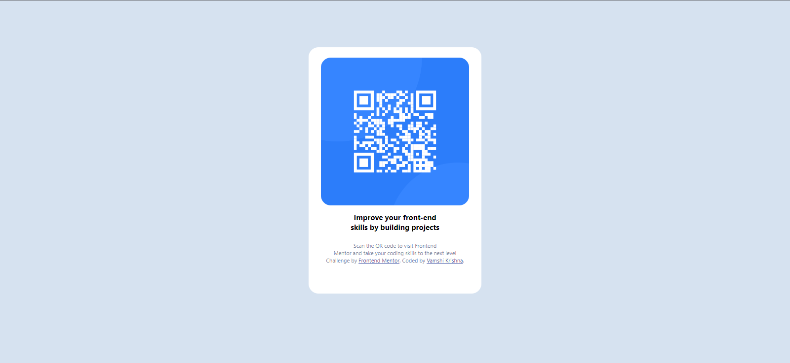

# Frontend Mentor - QR code component solution

This is a solution to the [QR code component challenge on Frontend Mentor](https://www.frontendmentor.io/challenges/qr-code-component-iux_sIO_H). Frontend Mentor challenges help you improve your coding skills by building realistic projects.

## Table of contents

- [Overview](#overview)
  - [Screenshot](#screenshot)
  - [Links](#links)
  - [Built with](#built-with)
  - [Useful resources](#useful-resources)
- [Author](#author)

## Overview

- This is a good exercise for my coding knowledge. It helped me to develop my CSS knowledge.

### Screenshot

### Links

- Live Site URL: (https://vvk-qr-codecomponent.netlify.app)

### Built with

- Semantic HTML5 markup
- CSS custom properties
- Flexbox
- CSS Grid
- Desktop-first workflow

### Useful resources

- (https://www.w3schools.com/css/css_rwd_mediaqueries.asp) - This helped me for understanding media queries. I really liked this pattern and will use it going forward.

## Author

- Frontend Mentor - [@thealmight](https://www.frontendmentor.io/profile/thealmight)
  #Qr-code-component
